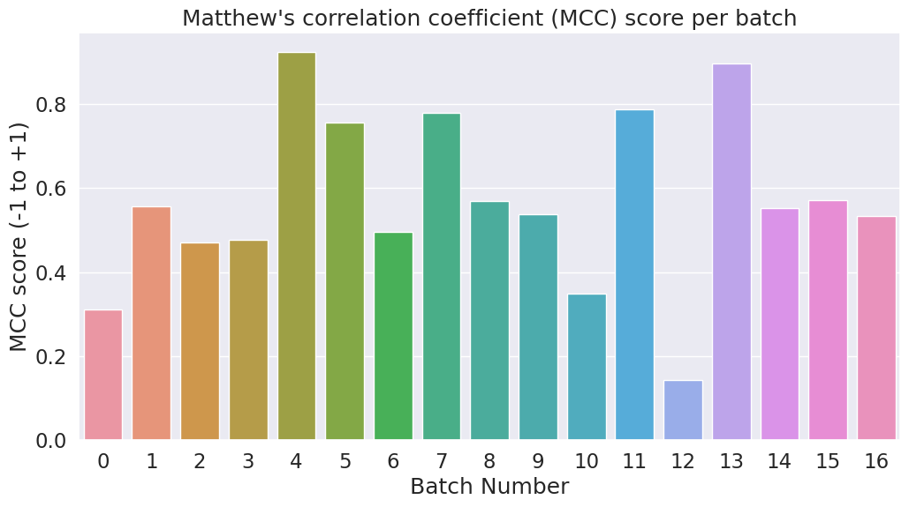

# BERT for Sentence Classification

This repository contains code and resources for fine-tuning BERT for sentence classification tasks.

## Contents

1. [Introduction](#introduction)
2. [Loading CoLA Dataset](#loading-cola-dataset)
3. [Tokenization & Input Formatting](#tokenization--input-formatting)
4. [Handling Sentence Length](#handling-sentence-length)
5. [Training Our Classification Model](#training-our-classification-model)
6. [Performance on Test Set](#performance-on-test-set)
7. [Conclusion](#conclusion)

## Introduction

In this project, we demonstrate how to fine-tune BERT, a powerful pre-trained language model, for sentence classification tasks. BERT has shown remarkable performance across various NLP tasks due to its deep contextual understanding of language.

## Loading CoLA Dataset

The Corpus of Linguistic Acceptability (CoLA) dataset is a standard benchmark for evaluating sentence classification models. It consists of sentences labeled as grammatically correct or incorrect. [Download CoLA Dataset](https://nyu-mll.github.io/CoLA/)

## Tokenization & Input Formatting

We utilize BERT's tokenizer to convert sentences into tokenized inputs and format them according to BERT's requirements for input.

## Handling Sentence Length

To handle varying sentence lengths, we create attention masks to indicate which tokens should be attended to during training and inference.

## Training Our Classification Model

We construct and train a BERT-based sequence classification model using the tokenized inputs and labels.

## Performance on Test Set

We evaluate the trained model's performance on a separate test set. Below is the graph showing the Matthew's correlation coefficient (MCC) scores across different experiments:

## Conclusion

We conclude by reflecting on the results obtained and discussing potential next steps for further improvement or exploration.
